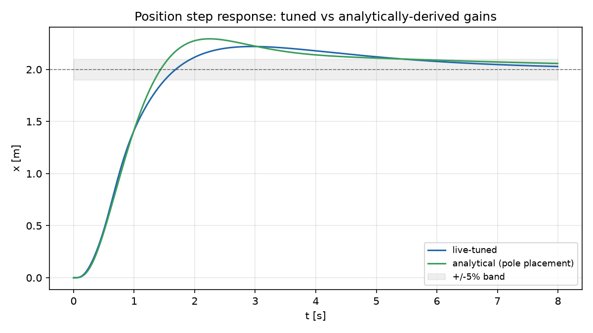
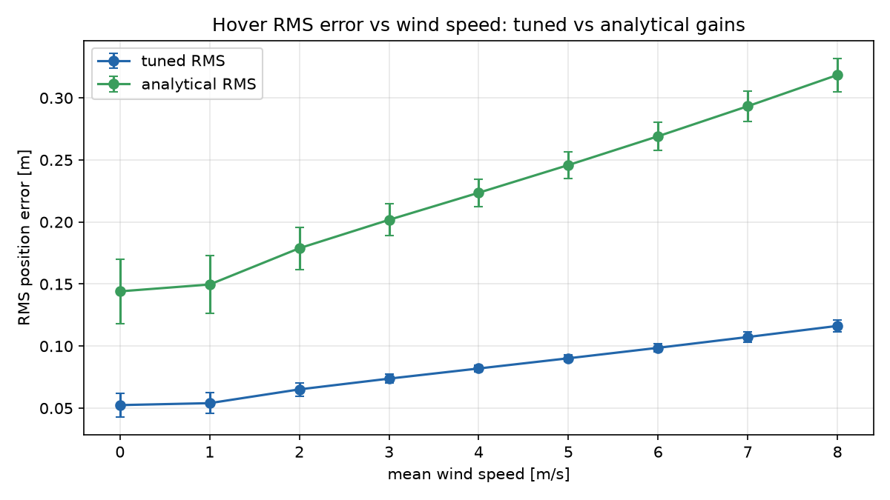

# UAV Wind-Disturbance Rejection Simulator

A 6-DOF quadrotor flight simulator built to test a PID flight controller against a 
simple wind model. Aims to test how well the controller can reject turbulent and gusting winds
with no information on the wind model, as well as how accurately the controller can hold a trajectory
under disturbance. All parameters are modeled on the Bitcraze Crazyflie 2.1 drone, a small quadrotor used
to teach programming. 

## Live Demo
Try the sim live at uav-wind-sim.fly.dev

Pick between either maintaining hover or one of the preset trajectories, dial in
mean wind speed, direction and turbulence intensity, and run the simulation. Users
can fire one-shot or continuous gusts whenever the UAV is in motion to see how the 
controller corrects and adjusts in real time. The app also has a built-in tuning tab,
allowing users to make live adjustments to gain values and observe how they change the 
controllers stability & accuracy. As gain values are adjusted, the controller rebuilds in
real-time and uses the new values for its next frame. 

## Architecture
This simulator is broken down into three independent Python modules and visualized through a front-end 
browser app. The controller never has any information on the wind model and only interact through the physics
experienced by the drone. 
```
setpoint → outer PID loop → thrust-vector inversion → inner PD loop → dynamics (RK4) → state
                ↑                                                          ↓
                └──────────────────── fed back each step ──────────────────┘

```
## Vehicle: Bitcraze Crazyflie 2.1

| Parameter | Value | Source |
|---|---|---|
| Mass | 0.030 kg | CF2.1 datasheet |
| Roll / pitch inertia, $I_{xx}=I_{yy}$ | $1.4\times10^{-5}\ \text{kg·m}^2$ | Förster, 2015 (system ID thesis) |
| Yaw inertia, $I_{zz}$ | $2.17\times10^{-5}\ \text{kg·m}^2$ | CAD-based estimate |
| Max total thrust | 0.60 N | 4 × ~150 mN motors |
| Max roll / pitch torque | 0.015 N·m | differential thrust, 46 mm arm |
| Max yaw torque | 0.005 N·m | reaction-torque estimate |
| Max tilt angle | 30° | PX4 `MPC_TILTMAX` default |
| Hover thrust | ~0.294 N | $mg$, ≈49% throttle |

## Dynamics
The state of the UAV is represented by a 12 element vector s describing position 
and velocity in world frame, the Euler angles, and body-frame angular rates: 

$$s = [x,\dot x,\ y,\dot y,\ z,\dot z,\ \phi,p,\ \theta,q,\ \psi,r]$$

Attitude is represented with a ZYX Euler rotation matrix:
$R = R_z(\psi)R_y(\theta)R_x(\phi)$

The matrix first converts yaw, then pitch, and then roll by the 3-2-1 convention. Body
rates are related to Euler rates by a kinematic matrix $W$, built by
expressing each Euler-rate axis in the body frame and inverting:

$\dot\Theta = W(\phi,\theta,\psi)\,\omega$.

Translational dynamics in the world frame are represented by the differential equation:

$$\ddot{\mathbf p} = \frac{T R e_3 + F_{wind}}{m} - g\,e_3$$

Rotational dynamics in the body frame, including coupling between axes, are described by:

$$J\dot\omega = \tau - \omega \times (J\omega)$$

The Euler equations of motion are integrated and solved with a fixed-step RK4 at 200 Hz ($dt = 0.005\ \text{s}$).

## Wind Model
Wind is modeled as a time series at the vehicle's own position rather than a
spatial field, which is equivalent under Taylor's frozen-turbulence hypothesis for a vehicle
but simpler to model:  

$$v_{wind}(t) = v_{mean} + v_{turb}(t) + v_{gust}(t)$$

Mean wind is a constant vector, magnitude and direction set by sliders:

$$v_{mean} = V_{mean}\,[\cos\phi_{az},\ \sin\phi_{az},\ 0]$$

Turbulence follows the Dryden model, which is standard for aircraft turbulence simulation.
The continuous shaping filter is a first-order low-pass with time constant $T = L/V$, which 
resembles an Ornstein-Uhlenbeck process, allowing us to discretize it with the exact OU transition:

$$y_k = e^{-\alpha}\,y_{k-1} + \sigma\sqrt{1-e^{-2\alpha}}\,\mathcal N(0,1), \qquad \alpha = \frac{V\,dt}{L}$$

Length scales use the MIL-F-8785C's low-altitude form taken from the Cole & 
Wickenheiser paper (Table 3.1):

$$L_w = z, \qquad L_u = L_v = \frac{z}{(0.177 + 0.000823z)^{1.2}}$$

Turbulence intensity is simplified to one isotropic constant instead of separate
values per-axis, as standard along and cross-track splits require a preferred heading,
which is not present on a symmetrical quadrotor. 

A discrete gust is modeled by the standard 1-cosine profile, fired on user input:

$$g(t) = \frac{V_{gust}}{2}\left(1 - \cos\frac{2\pi t}{T_{gust}}\right), \qquad 0 \le t \le T_{gust}$$

Wind force is defined by the relative velocity between the vehicle and air, rather
than the wind velocity alone, as a vehicle drifting with the wind would feel 0 force:

$$F_{wind} = k_{drag}\,(v_{wind} - v_{drone})$$.

## Controller
This controller uses a cascaded PID ran at the physics rate (200 Hz), which was
chosen over LQR or other control schemes because PID feedback rejects
disturbances without ever modeling the wind force within the controller, making
verification simpler. The integral term of the controller absorbs all sustained
wind-induced position error and brings it back to zero without being fed any information
on the experienced wind force. 

The controllers outer loop has one PID per axis, using position error to command new translational
acceleration:

$$a_{x,cmd} = K_p e_x + K_i\!\int\! e_x\,dt + K_d\dot e_x, \qquad e_x = x_{des} - x$$,

with the same form for $y$ and $z$. Since a quadrotor can't directly produce horizontal force as 
thrust is only along the body $z$, the output of each loop must become the next loop's setpoint, requiring
a cascaded controller. 

Thrust-vector inversion converts the commanded acceleration into new desired thrust and attitude vectors
using the following geometric conversion, derived in the Lee, Leok & McClamroch paper: 

$$z_{des} = \frac{[a_x,\,a_y,\,a_z+g]}{\lVert[a_x,\,a_y,\,a_z+g]\rVert}, \qquad T_{des} = m\lVert[a_x,\,a_y,\,a_z+g]\rVert$$

The $+g$ is fed forward since the dynamics equation always subtracts $g$ and it must be added back. A desired heading is 
calculated by fixing the remaining rotational freedom about $z_{des}$, allowing for roll and pitch target values: 

$y_c = [-\sin\psi_{des}, \cos\psi_{des}, 0]$ 

$y_c$ crossed with $z_{des}$ gives the full rotation matrix $R_{des}$, and roll and
pitch targets are pulled directly from it. This replaces the simpler
$\theta_{des} = \text{atan2}(a_x, a_z+g)$ formula used in planar (3-DOF)
versions of this controller, which only holds at zero yaw.

The inner loop is PD only, attitude error to torque, no integral — attitude
error doesn't build up a steady-state bias under wind the way position error
does:

$$\tau_{cmd} = K_p e_\theta + K_d \dot e_\theta$$

Anti-windup is handled through clamping and conditional integration, similar to PX4
and ArduPilot: each PID only accumulates its integral while the actuator it's feeding
still has headroom in the direction of the error. Each call of `PID.update()` first
computes a trial integral step, and is only committed once the loop's saturation is known.
The x and y loops are also set to freeze together rather than independently, since roll and pitch
target values are both calculated from the same thrust-vector inversion described above. 

The derivative term differentiates the measurement, not the error, so a
setpoint discontinuity like a path switch or live gain change can't read as an unbounded 
rate and saturate output. On its first call, a fresh PID reports zero derivative. 

## Results

`python/validate.py` regenerates every number and plot below. It checks the
live-tuned gains (`tuner_defaults.json`) against an independently-derived
analytical baseline across three tests: preset-path tracking, a position
step, and a wind-speed sweep.

**Analytical baseline.** Each position axis is a double integrator
(thrust-vector inversion + gravity feedforward), so standard PD pole
placement applies: $K_p=\omega_n^2$, $K_d=2\zeta\omega_n$. Targeting
$\zeta=1/\sqrt2$ and a 3s settling time gives $K_p=3.56$. The attitude loop
is the same math scaled by $J$, placed 8x faster per standard cascade
practice, giving $K_{p,att}=0.00319$, within 2% of the live-tuned 0.00315,
despite coming from nothing but inertia and a bandwidth rule. The position gains aren't 
as close: live-tuned $K_p=7.45$ is roughly double the analytical target.

**Preset-path tracking**: cross-track RMS error as a percent of path scale,
wind + a mid-flight gust, averaged over 6 trials. Cross-track is distance to
the nearest point anywhere on the reference curve, rather than the point at the
same time index, to measure how well the controller adheres to the path's shape 
under wind stress, regardless of timing. 

| path | live-tuned | analytical |
|---|---|---|
| hover | 3.1% | 8.3% |
| circle | 16.2% | 14.3% |
| figure-eight | 13.9% | 10.9% |

**Step response**



| | overshoot | settling (5%) | rise (10-90%) |
|---|---|---|---|
| live-tuned | 11.0% | 5.44s | 1.03s |
| analytical | 14.7% | 5.45s | 0.90s |

Analytical values overshoot slightly more than tuned despite linear
theory predicting only 4.3%, since pole placement on the idealized
double-integrator doesn't capture the inner loop's lag or the
thrust-inversion nonlinearity.

**Wind rejection**



| | RMS @ 0 m/s | RMS @ 8 m/s |
|---|---|---|
| live-tuned | 0.053 m | 0.116 m |
| analytical | 0.144 m | 0.319 m |

Here, the tuned values are far more accurate; live tuned error stays roughly
a third of the values for analytical gains across the full range, and thrust
saturation is never reached. 

## References

- Cole, K. & Wickenheiser, A. (2019). *Dynamic Modeling of Wind Disturbances on Small UAVs.* [arXiv:1905.09954](https://arxiv.org/abs/1905.09954)
- Palomaki, R. et al. (2019). *Wind Estimation on Small Unmanned Aircraft Systems.* [arXiv:1902.01465](https://arxiv.org/abs/1902.01465)
- Lee, T., Leok, M., & McClamroch, N. H. (2010). *Geometric Tracking Control of a Quadrotor UAV on SE(3).* IEEE CDC.
- Förster, J. (2015). *System Identification of the Crazyflie 2.0 Nano Quadrocopter.* ETH Zürich Bachelor Thesis.
- U.S. Dept. of Defense, MIL-HDBK-1797B / MIL-F-8785C — *Flying Qualities of Piloted Aircraft.*
- Franklin, G. F., Powell, J. D., & Emami-Naeini, A. *Feedback Control of Dynamic Systems.* Pearson. Second-order pole-placement formulas used in [Results](#results).
